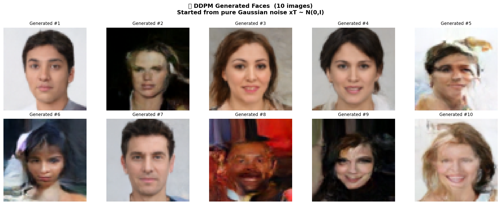
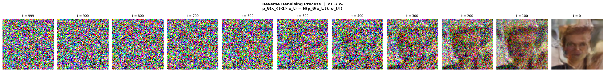
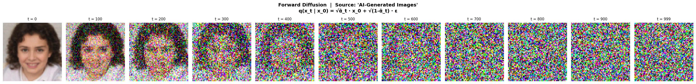
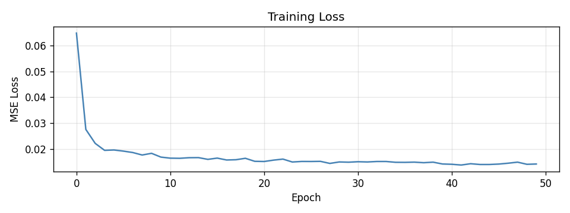
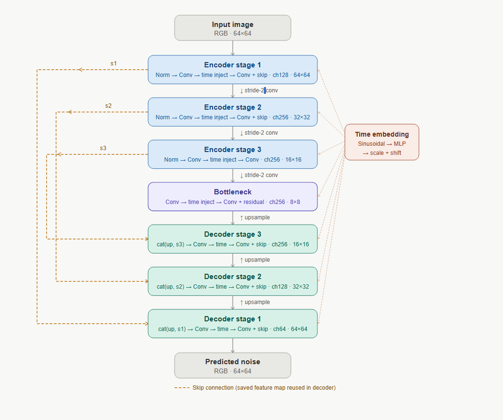

# 🧠 DDPM Face Generation — From Scratch

> **Solo project.** Built end-to-end by a single person on a free-tier Colab T4 GPU.  
> No pre-trained weights. No fine-tuning. Pure DDPM, pure PyTorch, pure grit.

---









---

## What This Is

A **Denoising Diffusion Probabilistic Model (DDPM)** trained from scratch to generate human faces, following the original [Ho et al. 2020](https://arxiv.org/abs/2006.11239) paper. Every component — the noise schedule, the U-Net, the training loop, the sampler — was implemented manually in a single Jupyter notebook.

This is not a wrapper around Hugging Face Diffusers. This is the math, written out in code.

🚀 **Live Demo:** [diffusionya.streamlit.app](https://diffusionya.streamlit.app)


---

## The Problem: Limited Compute

This project ran entirely on a **free Google Colab T4 GPU** (≈15 GB VRAM), which hit hard limits:

- Ran out of CUDA memory mid-training when batch sizes or image resolutions were too large
- The second architecture version (consolidated U-Net) was rewritten specifically to reduce peak memory usage
- 50 epochs was the feasible training budget — researchers typically run 200–1000+
- Sampling 1000 reverse steps per image is slow on a T4; parallelism is limited

Despite these constraints, the model generates recognizable faces, demonstrates a clean loss curve, and produces coherent denoising trajectories. **Working within limits is the skill.**

---

## Architecture — End to End

### 1. The Big Picture: What DDPM Does

DDPM models two processes:

```
Forward  (training):  x₀ ──noise──► x₁ ──noise──► ... ──noise──► xT  (pure Gaussian)
Reverse  (sampling):  xT ◄──denoise── ... ◄──denoise── x₁ ◄──denoise── x₀  (generated image)
```

The model never learns to directly generate images. It learns one thing: **predict the noise** that was added at each step. Everything else follows from that.

---

### 2. The Noise Schedule (`DiffusionSchedule`)

A **linear β schedule** controls how much noise is added at each of the T=1000 timesteps:

```
β₁ = 0.0001  →  βT = 0.02     (linearly increasing)
αt = 1 - βt
ᾱt = α₁ · α₂ · ... · αt      (cumulative product)
```

The key insight is the **closed-form forward process** — you can jump directly from a clean image x₀ to any noisy version xₜ without looping:

```
x_t = √ᾱ_t · x₀  +  √(1 - ᾱ_t) · ε,     ε ~ N(0, I)
```

This is what `forward_process.png` shows: one image degraded at t=0, 100, 200, ..., 999.

---

### 3. The U-Net (Noise Predictor)

The U-Net takes `(x_t, t)` as input and outputs `ε_θ(x_t, t)` — its best guess of the noise that was added.

**Spatial flow through the network:**



**Total parameters: ~12.5M**

---

### 4. Building Blocks

#### `SinusoidalTimeEmbedding`
The model needs to know *which* timestep it's operating at — otherwise it can't calibrate how much noise to expect. This uses the same positional encoding as Transformers:

```
PE(t, 2i)   = sin(t / 10000^(2i/d))
PE(t, 2i+1) = cos(t / 10000^(2i/d))
```

The raw embedding (dim=256) is then passed through a 2-layer MLP with SiLU activations to produce a richer representation.

#### `ResBlock` (with Time Conditioning)
Every ResBlock is **time-aware**. After the first convolution, the timestep embedding is injected as an **affine scale + shift** (AdaGN style):

```
h = conv1(x)
scale, shift = split(Linear(t_emb))          # from time projection
h = h × (1 + scale) + shift                  # modulate features by timestep
h = conv2(h)
output = h + skip(x)                          # residual connection
```

This is how the network learns to behave differently at t=50 (slightly noisy) vs t=900 (nearly pure noise).

#### `DownBlock`
ResBlock + strided Conv2d (stride=2) that halves spatial dimensions and doubles channels.

#### `UpBlock`
ConvTranspose2d (stride=2) that doubles spatial dimensions, concatenates the corresponding encoder skip connection, then passes through a ResBlock.

#### Normalization & Activation
- **GroupNorm(8)** — preferred over BatchNorm for generative models (stable at small batch sizes)
- **SiLU (Swish)** — smooth activation function that empirically outperforms ReLU in diffusion models

---

### 5. Training

**Objective (DDPM loss):**
```
L = E[t, x₀, ε][ ||ε - ε_θ(x_t, t)||² ]
```

In plain English: for each training step, corrupt a real image with known noise at a random timestep, ask the model to predict that noise, and minimize the squared error between prediction and ground truth.

**Training loop per step:**
1. Sample random timesteps `t ~ Uniform(0, T)` for each image in batch
2. Sample Gaussian noise `ε ~ N(0, I)`
3. Compute noisy images: `x_t = √ᾱ_t · x₀ + √(1-ᾱ_t) · ε`
4. Forward pass: `ε_pred = U-Net(x_t, t)`
5. Loss: `MSE(ε_pred, ε)`
6. Backprop with gradient clipping (`max_norm=1.0`)

**Optimizer:** AdamW (`lr = 2e-4`)  
**Scheduler:** Cosine annealing (LR decays from `2e-4` → `1e-6` over 50 epochs)  
**Epochs:** 50  
**Batch size:** 32

---

### 6. Sampling (Reverse Diffusion)

Generating a new image means running the reverse process from `xT ~ N(0,I)`:

```
For t = T, T-1, ..., 1, 0:
    ε_pred = U-Net(x_t, t)
    
    mean = (1/√α_t) · (x_t - (β_t / √(1-ᾱ_t)) · ε_pred)
    
    if t > 0:
        x_{t-1} = mean + √β_t · z,   z ~ N(0, I)
    else:
        x_0 = mean                    # no noise at final step
```

Each step removes a small amount of noise, guided by the model's noise prediction. After 1000 steps, structured images emerge from pure Gaussian noise.

`denoising_process.png` captures snapshots every 100 steps, showing this emergence.

---


## Dataset

- **Human Faces** dataset (loaded via `torchvision.datasets.ImageFolder`)
- Images resized to **256×256**, normalized to `[-1, 1]`
- Stored on Google Drive; loaded into Colab at runtime
- DataLoader: `batch_size=32`, `num_workers=2`, `pin_memory=True`

---

## Environment

```
Platform    : Google Colab (free tier)
GPU         : NVIDIA T4 (≈15 GB VRAM)
Framework   : PyTorch + torchvision
Python      : 3.12
Key deps    : torch, torchvision, matplotlib, numpy, tqdm, math
```

---


## References

- Ho et al. (2020) — [Denoising Diffusion Probabilistic Models](https://arxiv.org/abs/2006.11239)
- Nichol & Dhariwal (2021) — [Improved DDPMs](https://arxiv.org/abs/2102.09672)
- Song et al. (2020) — [DDIM](https://arxiv.org/abs/2010.02502)


